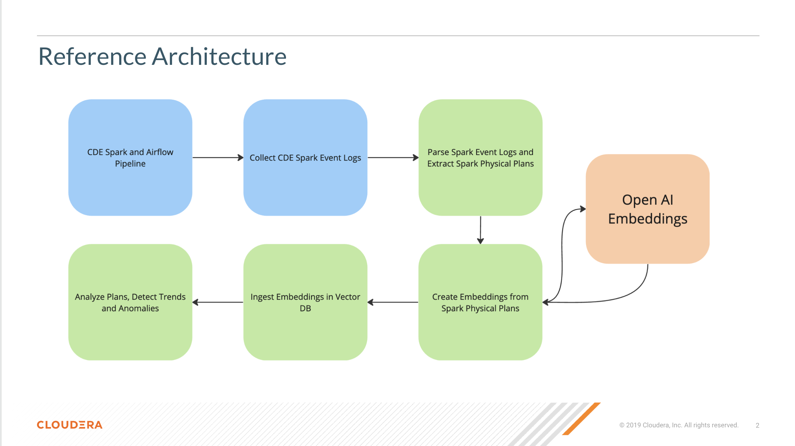

# CDE Log Analysis with Gen AI

## Objective

In this project we analyze CDE logs at scale with the help of Gen AI. At a high level we:

1. Build a CDE Spark and Airflow pipeline and ingest logs in a CML Project.
2. Transform CDE Event Logs into Embeddings with the OpenAI API and ingest them into a Vector DB.
3. Deploy a CML session and application to explore and visualize Spark Logs and derive useful insights.

This project is an ongoing effort and more and more use cases are being studied and added. For now, the main use case is Spark Physical Plan clustering for anomaly detection.

Other use cases including hybrid cloud, proactive Spark tuning, Oozie to CDE migrations are under development. If you want to collaborate on any of the above please open a PR.

### About the Cloudera Data Engineering (CDE) Service

CDE is the Cloudera Data Engineering Service, a containerized managed service for Cloudera Data Platform designed for Large Scale Batch Pipelines with Spark, Airflow and Iceberg. It allows you to submit batch jobs to auto-scaling virtual clusters. As a Cloud-Native service, CDE enables you to spend more time on your applications, and less time on infrastructure.

CDE allows you to create, manage, and schedule Apache Spark jobs without the overhead of creating and maintaining Spark clusters. With CDE, you define virtual clusters with a range of CPU and memory resources, and the cluster scales up and down as needed to run your Spark workloads, helping to control your cloud costs.

### About the Cloudera Machine Learning (CML) Service

Cloudera Machine Learning (CML) is Cloudera’s platform for machine learning and AI. CML unifies self-service data science and data engineering in a single, portable service as part of an enterprise data cloud for multi-function analytics on data anywhere.

Large scale organizations use CML to build and deploy machine learning and AI capabilities for business at scale, efficiently and securely. CML is built for the agility and power of cloud computing, but can also operate inside your private and secure data center.

## Requirements

The following are required in order to reproduce this project:

* A Cloudera Data Engineering Virtual Cluster with CDE Service Version 1.19 or above and Spark 3.X.
* A Cloudera Machine Learning Workspace on version 2.0.41 or above.
* Private or Public Cloud - OCP, ECS, AWS, Azure OK.
* Basic familiarity with Python, Spark and Spark Event Logs, NLP, Deep Learning and Vector Databases are recommended.

## Conclusions and Next Steps

CDE provides advanced Spark and Airflow Observability capabilities and allows you to store and download rich Spark job logs long after job execution. With CML you can easily download and process large datasets, such as CDE Spark Event logs, and build Gen AI applications with Vector Databases and flexible Cloud resources. With CML you can process logs as embeddings and easily identify anomalies.

If you are using CML for Deep Learning, GenAI and LLM use cases here are some more examples you may find interesting:

* [CML LLM Hands on Lab](https://github.com/SuperEllipse/CML-LLM-HOL-Workshop)
* [LLM Demo in CML](https://github.com/SuperEllipse/LLM-demo-on-CML)
* [How to Launch an Applied Machine Learning Prototype (AMP) in CML](https://docs.cloudera.com/machine-learning/cloud/applied-ml-prototypes/topics/ml-amps-overview.html)
* [AMP: Intelligent QA Chatbot with NiFi, Pinecone, and Llama2](https://github.com/cloudera/CML_AMP_Intelligent-QA-Chatbot-with-NiFi-Pinecone-and-Llama2)
* [AMP: Text Summarization and more with Amazon Bedrock](https://github.com/cloudera/CML_AMP_AI_Text_Summarization_with_Amazon_Bedrock)
* [AMP: Fine-Tuning a Foundation Model for Multiple Tasks (with QLoRA)](https://github.com/cloudera/CML_AMP_Finetune_Foundation_Model_Multiple_Tasks)
* [AMP: LLM Chatbot Augmented with Enterprise Data](https://github.com/cloudera/CML_AMP_LLM_Chatbot_Augmented_with_Enterprise_Data)
* [AMP: Semantic Image Search with Convolutional Neural Networks](https://github.com/cloudera/CML_AMP_Image_Analysis)
* [AMP: Deep Learning for Anomaly Detection](https://github.com/cloudera/CML_AMP_Anomaly_Detection)
* [AMP: Deep Learning for Question Answering](https://github.com/cloudera/CML_AMP_Question_Answering)
* [AMP: Automatic Text Summarization](https://github.com/cloudera/CML_AMP_Summarize)
* [Quickstarts with PyTorch, Tensorflow and MXNet in CML](https://github.com/pdefusco/cml_deeplearning)
* [Distributed PyTorch with Horovod and CML Workers in CML](https://github.com/pdefusco/Distributed_PyTorch_Horovod)
* [Distributed Tensorflow with CML Workers in CML](https://github.com/pdefusco/Distributed_Tensorflow_CML)
* [An end to end example of PyTorch and MLFlow in CML](https://github.com/pdefusco/CML_MLFlow_PyTorch)
